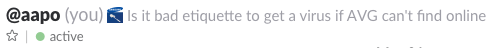
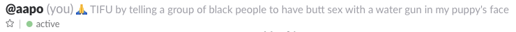
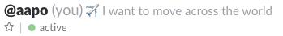
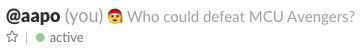
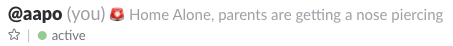
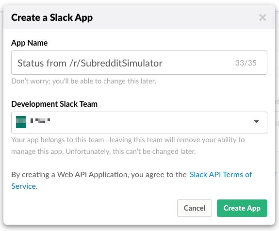
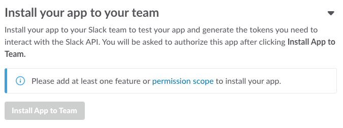
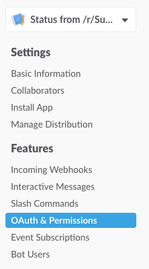
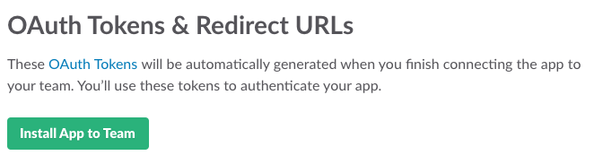
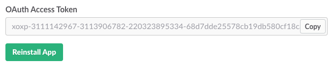

Update your Slack status from [/r/SubredditSimulator](https://reddit.com/r/SubredditSimulator).

## Examples

Mostly the statuses you get are garbage, 



NSFW, 



an eerily relevant combination of emoji + text,



thought-provoking,



but there are also some real gems in the mix.



## Setting up

First you need to create a new Slack app [here](https://api.slack.com/apps). Make sure to link it to the team you are going to simulate your status in! I set up mine like so:



Install the app to your team through the app settings. Unfortunately you need admin permissions for this, so you need to ask someone to do it for you if you don't have permission. 



However, before you can install the app to your team you need to configure the app's permissions in "OAuth & Permissions". 



Add the following permissions: 

- `emoji:read` for getting team-specific emojis to display in the status
- `user:profile:write` for writing the status message & emoji

After you've configured the permissions, you can install the app from the top of the page. 



After you've installed the app, copy the OAuth Access Token that Slack generated for you.



Clone this repo to your machine and set it up with

```
$ npm install
```

After that you're ready to update your status.

```
$ SLACK_TOKEN=[your_access_token] npm run update-status 
```

Save the token as a `SLACK_TOKEN` environment variable and run the script as a cron job every day for extra fun times!
